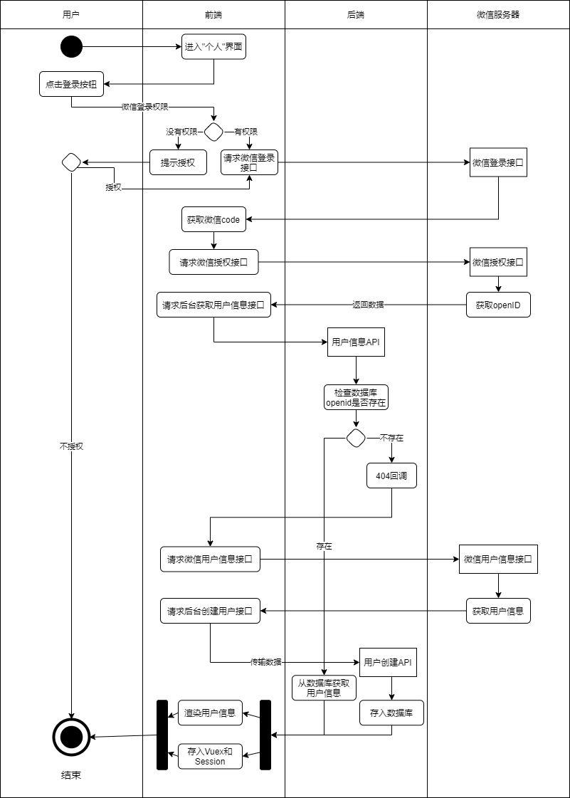

### 基于微信小程序的程序员交流社区的设计与实现

## 1. 绪论

## 2. 系统需求分析

#### 2.1 系统功能分析

​	交流社区系统的大体要求是：文章和话题编辑、点赞、评论、收藏、搜索和推送

##### 2.1.1 微信小程序端功能需求分析

 1. 用户注册与登录

    通过用户的openID实现登录注册

 2. 文章和话题的浏览

    未登录和登录状态的区分及话题和文章的分类显示

 3. 关注用户的文章推送

    将用户关注的作者编写的文章和话题排序推送显示

 4. 文章的点赞

    对文章进行点赞

 5. 文章的收藏

    对文章进行收藏

 6. 话题的回复

    对话题通过文章的形式回复

 7. 个人话题和文章的管理

    在个人信息界面对个人的话题和文章进行管理

 8. 个人信息的管理与查看

    在个人信息界面管理和查看用户的个人信息

 9. 其他作者的个人信息及话题和文章的查看

    在话题、文章、关注用户列表和粉丝列表等地方点击对应的用户跳转显示查看对应用户的个人信息、文章和话题

 10. 其他用户的关注和管理

     在个人信息界面查看关注列表

 11. 粉丝列表功能的实现

     在个人信息界面查看粉丝列表

 12. 反馈功能的实现

     用户向管理员提供对系统的反馈和意见的实现

 13. 用户积分的实现

     用户编辑文章、编辑话题和回复话题等都可以增加个人的积分， 不同等级的分数可以编辑不同字数的话题

 14. 自建话题

     在工具界面编辑生成新的话题

 15. 文章编辑

     在工具界面编辑生成新的文章

 16. 文章的评论以及回复评论

     对文章进行评论和对评论进行评论

 17. 个人报表

     根据用户个人的浏览记录生成报表

 18. 系统通知的推送

     打开程序弹出拟态框显示系统的通知

##### 2.1.2 管理端功能需求分析

	1. 管理员的登录
	2. 系统的报表和下载报表
	3. 管理员个人信息的编辑和查看
	4. 管理员列表和管理等级比登录管理员等级低的管理员关系
	5. 管理员权限管理
	6. 用户列表及用户管理
	7. 话题的编辑
	8. 文章的编辑
	9. 通知的编辑
	10. 用户反馈的查看的实现
	11. 添加文章和话题的分类标签
	12. 添加新的管理员

##### 2.1.3 用户桌面编辑器功能需求分析

	1. 用户登录
	2. 用户编辑文章和话题

#### 2.2 系统用例分析

##### 2.2.1 系统用例图

用例可划分为两个用例图：用户用例图，管理员用例图

## 3 系统设计

#### 3.1 系统的总体设计

​	**本部分将通过系统结构和功能结构来描述系统的总体设计**

##### 3.1.1 系统的系统结构

##### 3.1.2 系统功能结构

#### 3.2 系统模块设计

##### 3.2.1 用户登录注册功能模块

